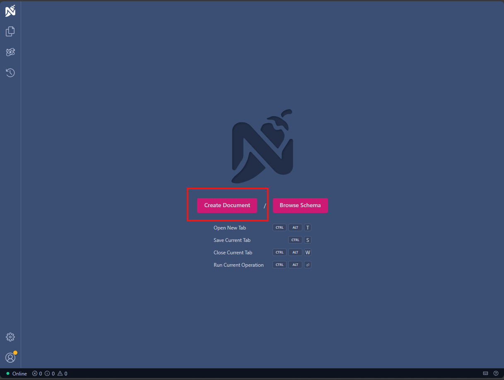

# Step 4: Run Basic Query Against Your Own GraphQL Server

In [Step 3](./Step3.md), you have created a basic GraphQL server. In this step, you are going to run queries against this server.

## Start your application
The project is configured to start the GraphQL endpoint. This endpoint does launch Nitro. This is a testbed for testing your API.



To start creating a query, select the Create Document button.

## Generated Schema

GraphQL works through a schema. In this workshop, we are not going to use the schema directly to write a service, but it is good to know a bit about the schema being used. In the Schema tab, you can inspect the schema that has been generated based on the code you wrote.


Our method GetAllOrders got generated into a field allOrders. The Get is removed automatically from the code. The [] indicate that a list of Orders is returned, and the exclamation mark indicates that the value cannot be null. By default, values in GraphQL can be null.


When you click on the Order type, the details of the schema for Order are shown. 


Every field has it own type specified, and you could drill further into the types by clicking on the links. GraphQL supports scalar types and object types. If you want to know more about the GraphQL schema language, you can visit https://graphql.org/learn/schema/.

## Create order query

Since this workshop is focused around building a service, let’s use the schema to construct a query. So go back to the Operation tab.

All queries start with the keyword query. If you only have one query, you don’t have to specify a name.

We start by simply adding a query that uses our allOrder schema. Copy this code to the Request tab.

```graphql
query {
  allOrders {
    # Insert your fields here
  }
}
```

GraphQL allows naming a query by specifying a name after the query keyword. However, if you only have one query in the request pane, naming is not required. You will use the named query option later in the workshop.

After the curly bracket you must specify the fields that you want to have returned by the query. This allows you to control the data that is returned from the service, so you can prevent overfetching fields that are not of interest to you.

```graphql
query {
  allOrders {
    customer {
      name
    }
    orderLines{
      product {
        name
      }
      quantity
    }
  }
}
```

Your Request pane now should now look like this.


If you run this query by hitting the Run button, you should get output similar to the following picture.


Since the test environment allows code completion, simply try to change the query to include the OrderStatus and OrderTime.

[Next step](./Step5.md)


