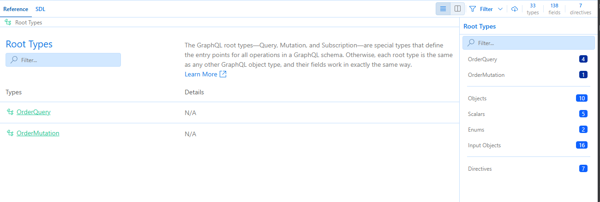
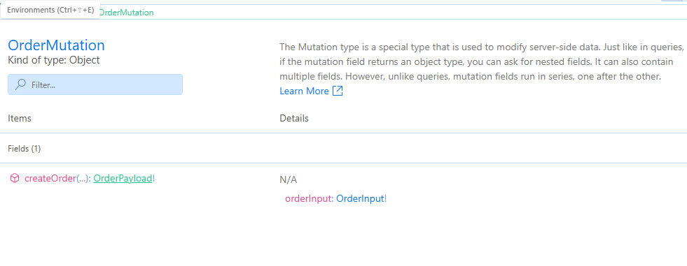
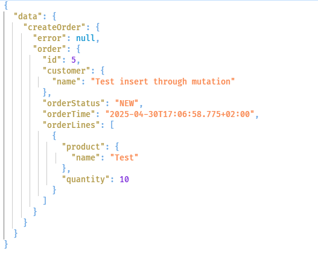
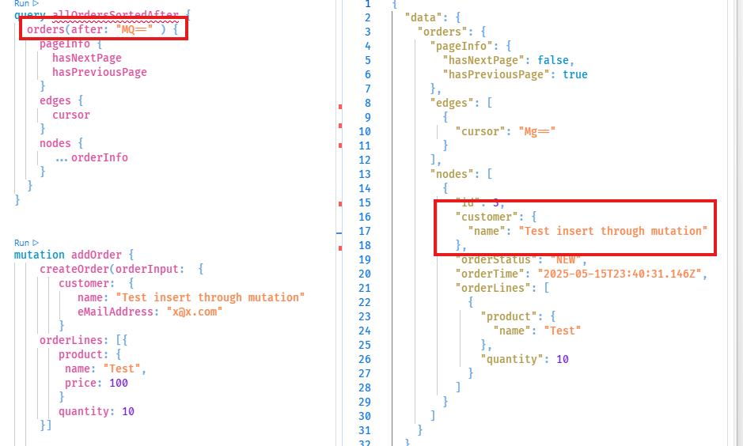

# Adding mutations

GraphQL is often used to query data. But it also allows you to update data on the server. Allowing updates is done through mutation. In this step you are going to add a mutation for an entire order to the service.

## Create mutation class

Create a Mutation class like the following code in your GraphQL folder.

```csharp
    public class OrderMutation
    {
        
    }
```

Just like the query you do not have to implement an attribute or derive from a base class.

We want create a method to allow a new order to be received by the server, added to the database and then returned to the caller.

The convention in HotChocolate is to create a Input class for the input parameter and a Payload class for the return value.

Let's start creating these classes before adding the method.

Create the following class. Name the file OrderInput.cs. Place this file in your GraphQL folder.

```csharp

namespace ShopAPI.GraphQL
{
    public class CustomerInput
    {
        public required string Name { get; set; }
        public string? EMailAddress { get; set; }
    }

    public class ProductInput
    {
        public string Name { get; set; } = null!;
        public decimal Price { get; set; }
    }

    public class OrderLineInput
    {
        public ProductInput Product { get; set; }
        public int Quantity { get; set; }
    }

    public class OrderInput
    {
        public CustomerInput Customer { get; set; } = null!;
        public List<OrderLineInput> OrderLines { get; set; } = new List<OrderLineInput>();  
    }
}


```

In this code we mimic the entire object graph, without including the id fields and some less important fields. You can of course split all the classes up in different files, but because of the limited scope for these classes, you can leave them in one file.

Create the following payload class in OrderPayload.cs

```csharp

public class OrderPayload
{
    public Order Order { get; set; } = null!;

    public string? Error { get; set; }

}

```

In this class the created order is returned and a field that can hold an error message.

With these classes in place, you can write your method in the mutation class.

```csharp

public async Task<OrderPayload> CreateOrderAsync(OrderContext orderContext,
    OrderInput orderInput)
{

}

```

As with most API code you have to do some mapping between the model Order and the received input and the created model order and the payload. 
To keep the code in the mutation method limited, you can create seperate mapper helper methods for this. This mapper simply maps the individual fields and relationships to each other.

Create an OrderExtensions class in the GraphQL folder and copy the code below into this file. 

```csharp

public static class OrderExtensions
    {
        public static Order ToOrder(this OrderInput orderInput)
        {
            var customer = new Customer()
            {
                Name = orderInput.Customer.Name,
                EMailAddress = orderInput.Customer.EMailAddress
            };

            var order = new Order()
            {
                Customer = customer,
                OrderStatus = Model.OrderStatus.NEW,
                OrderTime = DateTime.Now
            };

            foreach (var orderline in orderInput.OrderLines)
            {
                var product = new Product() { Name = orderline.Product.Name };
                var modelOrderLine = new OrderLine()
                {
                    Product = product,
                    Quantity = orderline.Quantity
                };

                order.OrderLines.Add(modelOrderLine);

            }

            return order;
        }

        public static OrderPayload ToPayload(this Order order)
        { 
            var orderPayload = new OrderPayload()
            {
                Order = order
            };

            return orderPayload;
        }

    }

```

With this mapper code in place, you can finally write the mutation code.

Update your code to match the following code.

```csharp

public async Task<OrderPayload> CreateOrderAsync(OrderContext orderContext,
    OrderInput orderInput)
{
    var order = orderInput.ToOrder();
    
    await orderContext.AddAsync(order);
    await orderContext.SaveChangesAsync();

    return order.ToPayload();
}

```

All the mutation code has to do, is calls the mappers and add the created object to EF Core and return the created object.


## Register the mutation type

All you to do now is register the mutation type with the GraphQL Service.

Update the code in your program.cs to match the following code.

```csharp

builder.Services.AddGraphQLServer()
    .AddQueryType<OrderQuery>()
    .RegisterDbContextFactory<OrderContext>()
    .AddProjections()
    .AddFiltering()
    .AddSorting()
    .AddMutationType<OrderMutation>();

```

## Run the code

If you now run the code and look into the available types, you can see that a new type has been created for your mutation. 



When you click on the OrderMutation type, you can see that a field for your method has been created that accepts our OrderInput and that returns our payload.



## Add an order to the database using GraphQL

In order to call our mutation you need to use a mutation keyword instead of the query keyword. Because the mutation also requires a parameter to be passed, you need to specify this parameter as well in your query.

Add the following query to your Request pane.

```graphql

mutation addOrder {
    createOrder(orderInput:  {
       customer:  {
          name: "Test insert through mutation"
          eMailAddress: "x@x.com"
       }
    orderLines: [{
       product: {
        name: "Test",
        price: 100
       }
       quantity: 10
    }]

    }) {
         error
         order {
          ...orderInfo
         }

    }
}

```

The orderinput is quite large, so the result fields are at the bottom of the query.

If you now run this query you will get a new order in your database. 



You can verify this by running the query to return the paged orders.




## Extra excercise

Add some more different orders to the database and change the page size for [Step 12](./Step12.md) and verify that the cursors for next and previous page actually work.


[Next step](./Step13.md)


